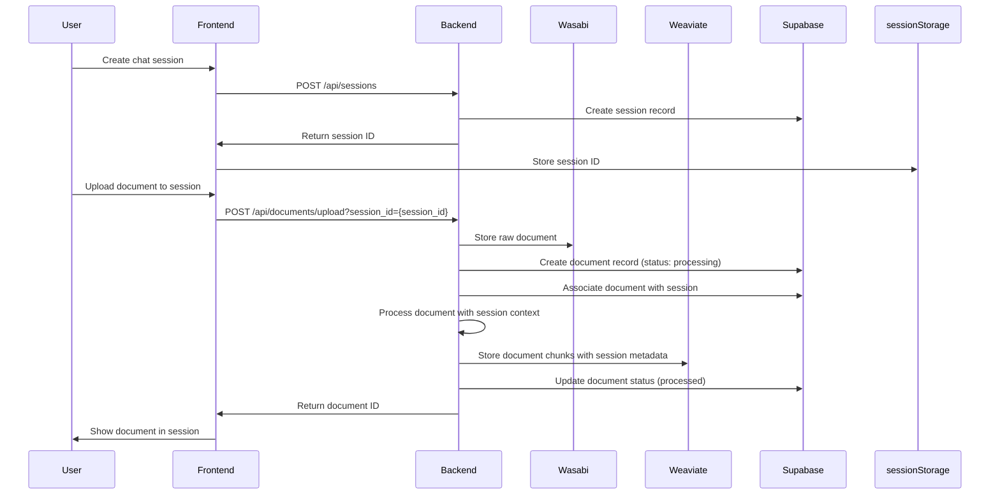
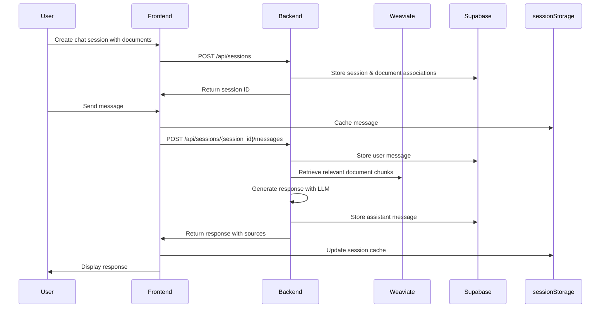

# AnyDocAI Comprehensive API Implementation Guide

## Overview

This document provides a comprehensive guide for implementing the AnyDocAI frontend, including the technical workflow, user workflow, data storage strategy, API implementation details, and complete API reference.

## User Workflow

1. **Authentication**
   - User registers or logs in
   - Authentication token is stored in cookies and localStorage
   - User can manage profile, change password, enable 2FA, etc.

2. **Session-First Document Management**
   - User creates a new chat session
   - User uploads documents directly to the session
   - Documents are processed and indexed in the backend with session context
   - User can view documents associated with the current session

3. **Chat Session Flow**
   - User interacts with documents in the current session
   - User sends messages and receives AI responses
   - User can switch between different chat sessions
   - Each session maintains its own document context

4. **Chat Modes**
   - User can toggle between RAG mode (simple document Q&A)
   - User can toggle Agent mode (for complex tasks like chart generation)

## Technical Workflow

### 1. Session-First Document Processing Flow



### 2. Chat Session Flow



## Data Storage Strategy

### 1. Server-side Storage

| Data Type | Storage System | Purpose |
|-----------|----------------|---------|
| User accounts | Supabase | Authentication and user management |
| Raw documents | Wasabi S3 | Original document storage |
| Document metadata | Supabase | Status, file info, ownership |
| Document chunks | Weaviate | Vector embeddings for semantic search |
| Chat sessions | Supabase | Session metadata and document associations |
| Chat messages | Supabase | Message history with metadata |

### 2. Client-side Storage

| Data Type | Storage System | Purpose |
|-----------|----------------|---------|
| Auth token | Cookies | Secure authentication |
| Current session | sessionStorage | Active session data |
| Recent messages | sessionStorage | Current conversation context |
| Document metadata | sessionStorage | Document info for current session |
| UI preferences | localStorage | User interface settings |

## API Implementation Details

### Authentication APIs

```javascript
// api/auth.js
export const authApi = {
  register: (email, password, fullName) =>
    axios.post('/api/auth/register', { email, password, full_name: fullName }),

  login: (email, password) =>
    axios.post('/api/auth/login', { email, password }),

  logout: () =>
    axios.post('/api/auth/logout'),

  getCurrentUser: () =>
    axios.get('/api/auth/me'),

  updateProfile: (fullName, email) =>
    axios.put('/api/auth/update-profile', { full_name: fullName, email }),

  changePassword: (currentPassword, newPassword) =>
    axios.put('/api/auth/change-password', { current_password: currentPassword, new_password: newPassword }),

  enable2FA: () =>
    axios.post('/api/auth/enable-2fa'),

  verify2FA: (code) =>
    axios.post('/api/auth/verify-2fa', { code }),

  disable2FA: (code) =>
    axios.delete('/api/auth/disable-2fa', { data: { code } }),

  deleteAccount: (password) =>
    axios.delete('/api/auth/delete-account', { data: { password } })
};
```

### Document APIs

```javascript
// api/documents.js
export const documentApi = {
  uploadDocumentToSession: (file, sessionId) => {
    const formData = new FormData();
    formData.append('file', file);

    const url = sessionId
      ? `/api/documents/upload?session_id=${sessionId}`
      : '/api/documents/upload';

    return axios.post(url, formData, {
      headers: { 'Content-Type': 'multipart/form-data' }
    });
  },

  listSessionDocuments: (sessionId) =>
    axios.get(`/api/chat/sessions/${sessionId}/documents`),

  getSessionDocumentDetails: (sessionId) =>
    axios.get(`/api/chat/sessions/${sessionId}/documents/details`),

  listAllDocuments: () =>
    axios.get('/api/documents/list'),

  getDocumentPreview: (documentId) =>
    axios.get(`/api/documents/${documentId}/preview`),

  deleteDocument: (documentId) =>
    axios.delete(`/api/documents/${documentId}`)
};
```

### Session APIs

```javascript
// api/sessions.js
export const sessionApi = {
  createSession: (name, documentIds = []) =>
    axios.post('/api/chat/sessions', { name, document_ids: documentIds }),

  listSessions: () =>
    axios.get('/api/chat/sessions'),

  getSession: (sessionId) =>
    axios.get(`/api/chat/sessions/${sessionId}`),

  updateSession: (sessionId, name) =>
    axios.put(`/api/chat/sessions/${sessionId}`, { name }),

  deleteSession: (sessionId) =>
    axios.delete(`/api/chat/sessions/${sessionId}`),

  addDocumentsToSession: (sessionId, documentIds) =>
    axios.put(`/api/chat/sessions/${sessionId}/documents`, { document_ids: documentIds }),

  removeDocumentFromSession: (sessionId, documentId) =>
    axios.delete(`/api/chat/sessions/${sessionId}/documents/${documentId}`)
};
```

### Chat APIs

```javascript
// api/chat.js
export const chatApi = {
  getMessages: (sessionId) =>
    axios.get(`/api/chat/sessions/${sessionId}/messages`),

  sendMessage: (sessionId, message, useAgent = false) =>
    axios.post(`/api/chat/sessions/${sessionId}/messages`, {
      message,
      use_agent: useAgent
    }),

  getSuggestions: (sessionId) =>
    axios.get(`/api/chat/sessions/${sessionId}/suggestions`),

  // Legacy endpoint for backward compatibility
  sendLegacyMessage: (message, useAgent = false) =>
    axios.post('/api/chat/message', {
      message,
      use_agent: useAgent
    })
};
```

## Session Storage Implementation

```javascript
// utils/sessionStorage.js
export const sessionStorageUtil = {
  // Current session data
  setCurrentSession: (sessionData) => {
    sessionStorage.setItem('currentSession', JSON.stringify(sessionData));
  },

  getCurrentSession: () => {
    const data = sessionStorage.getItem('currentSession');
    return data ? JSON.parse(data) : null;
  },

  // Messages cache
  cacheMessages: (sessionId, messages) => {
    sessionStorage.setItem(`messages_${sessionId}`, JSON.stringify(messages));
  },

  getCachedMessages: (sessionId) => {
    const data = sessionStorage.getItem(`messages_${sessionId}`);
    return data ? JSON.parse(data) : [];
  },

  // Document metadata cache
  cacheDocumentMetadata: (documentId, metadata) => {
    const cache = JSON.parse(sessionStorage.getItem('documentCache') || '{}');
    cache[documentId] = metadata;
    sessionStorage.setItem('documentCache', JSON.stringify(cache));
  },

  getCachedDocumentMetadata: (documentId) => {
    const cache = JSON.parse(sessionStorage.getItem('documentCache') || '{}');
    return cache[documentId] || null;
  }
};
```

## API Call Sequence Examples

### Example 1: Creating a new chat session, uploading documents, and sending a message

```javascript
// 1. Create a new session
const sessionResponse = await sessionApi.createSession("Research on Climate Change");

// 2. Store session in sessionStorage
const sessionId = sessionResponse.data.session_id;
sessionStorageUtil.setCurrentSession(sessionResponse.data);

// 3. Upload documents to the session
const fileInput = document.getElementById('fileInput');
const files = fileInput.files;
const uploadPromises = [];

for (let i = 0; i < files.length; i++) {
  uploadPromises.push(documentApi.uploadDocumentToSession(files[i], sessionId));
}

// Wait for all uploads to complete
const uploadResults = await Promise.all(uploadPromises);

// 4. Get documents associated with the session
const documentsResponse = await documentApi.listSessionDocuments(sessionId);
const documents = documentsResponse.data.documents;

// 5. Cache document metadata
documents.forEach(doc => {
  sessionStorageUtil.cacheDocumentMetadata(doc.file_id, doc);
});

// 6. Send a message
const messageResponse = await chatApi.sendMessage(
  sessionId,
  "Summarize the key findings from these documents."
);

// 7. Cache the messages
const messages = [
  { role: "user", content: "Summarize the key findings from these documents." },
  { role: "assistant", content: messageResponse.data.response }
];
sessionStorageUtil.cacheMessages(sessionId, messages);

// 8. Display the response to the user
displayMessage(messageResponse.data);
```

### Example 2: Continuing an existing chat session

```javascript
// 1. Get current session from sessionStorage
const currentSession = sessionStorageUtil.getCurrentSession();

// 2. Get cached messages or fetch from API if not cached
let messages = sessionStorageUtil.getCachedMessages(currentSession.session_id);
if (!messages.length) {
  const messagesResponse = await chatApi.getMessages(currentSession.session_id);
  messages = messagesResponse.data.messages;
  sessionStorageUtil.cacheMessages(currentSession.session_id, messages);
}

// 3. Display existing messages
displayMessages(messages);

// 4. Send a new message
const newMessage = "What are the economic impacts mentioned in the documents?";
const messageResponse = await chatApi.sendMessage(
  currentSession.session_id,
  newMessage
);

// 5. Update cached messages
messages.push(
  { role: "user", content: newMessage },
  { role: "assistant", content: messageResponse.data.response }
);
sessionStorageUtil.cacheMessages(currentSession.session_id, messages);

// 6. Display the new response
displayMessage(messageResponse.data);
```

## Complete API Reference

### Authentication Endpoints

| Endpoint | Method | Description | Request Body | Response |
|----------|--------|-------------|-------------|----------|
| `/api/auth/register` | POST | Register a new user | `email`, `password`, `full_name` (optional) | User data with token |
| `/api/auth/login` | POST | Login a user | `email`, `password` | User data with token |
| `/api/auth/me` | GET | Get current user info | None | User profile data |
| `/api/auth/logout` | POST | Logout user | None | Success message |
| `/api/auth/update-profile` | PUT | Update user profile | `full_name`, `email` | Updated user data |
| `/api/auth/change-password` | PUT | Change password | `current_password`, `new_password` | Success message |
| `/api/auth/enable-2fa` | POST | Enable 2FA | None | QR code and backup codes |
| `/api/auth/verify-2fa` | POST | Verify 2FA setup | `code` | Success message |
| `/api/auth/disable-2fa` | DELETE | Disable 2FA | `code` | Success message |
| `/api/auth/delete-account` | DELETE | Delete account | `password` | Success message |

### Document Endpoints

| Endpoint | Method | Description | Parameters | Response |
|----------|--------|-------------|------------|----------|
| `/api/documents/upload` | POST | Upload document | `file` (FormData), `session_id` (query param) | Document metadata |
| `/api/documents/list` | GET | List all documents | None | List of documents |
| `/api/documents/{file_id}/preview` | GET | Get document preview | `file_id` (path) | Document preview text |
| `/api/documents/{file_id}` | DELETE | Delete document | `file_id` (path) | Deletion status |

### Session Endpoints

| Endpoint | Method | Description | Parameters | Response |
|----------|--------|-------------|------------|----------|
| `/api/chat/sessions` | POST | Create session | `name`, `document_ids` (optional) | Session data |
| `/api/chat/sessions` | GET | List all sessions | None | List of sessions |
| `/api/chat/sessions/{session_id}` | GET | Get session details | `session_id` (path) | Session details |
| `/api/chat/sessions/{session_id}` | PUT | Update session | `session_id` (path), `name` | Updated session |
| `/api/chat/sessions/{session_id}` | DELETE | Delete session | `session_id` (path) | Deletion status |
| `/api/chat/sessions/{session_id}/documents` | GET | Get session documents | `session_id` (path) | List of document IDs |
| `/api/chat/sessions/{session_id}/documents` | PUT | Add documents to session | `session_id` (path), `document_ids` | Updated session |
| `/api/chat/sessions/{session_id}/documents/{document_id}` | DELETE | Remove document from session | `session_id` (path), `document_id` (path) | Updated session |
| `/api/chat/sessions/{session_id}/documents/details` | GET | Get session document details | `session_id` (path) | List of documents with details |

### Chat Endpoints

| Endpoint | Method | Description | Parameters | Response |
|----------|--------|-------------|------------|----------|
| `/api/chat/sessions/{session_id}/messages` | GET | Get session messages | `session_id` (path) | List of messages |
| `/api/chat/sessions/{session_id}/messages` | POST | Send message | `session_id` (path), `message`, `use_agent` | AI response |
| `/api/chat/sessions/{session_id}/suggestions` | GET | Get query suggestions | `session_id` (path) | List of suggestions |
| `/api/chat/message` | POST | Legacy chat endpoint | `message`, `use_agent` | AI response |

## Row Level Security (RLS) Considerations

When implementing the frontend, be aware that the backend uses Supabase with Row Level Security (RLS) policies to ensure data isolation between users. These policies ensure:

1. Users can only access their own data
2. Each user can only see their own documents, sessions, and messages
3. Service role operations bypass RLS for administrative functions

The frontend should handle authentication properly to ensure these security measures work correctly:

1. Store authentication tokens securely in cookies
2. Include authentication headers with all requests
3. Handle unauthorized errors appropriately
4. Refresh tokens when needed

## Error Handling

Implement proper error handling for API calls:

```javascript
try {
  const response = await chatApi.sendMessage(sessionId, message);
  // Handle success
} catch (error) {
  if (error.response) {
    // The request was made and the server responded with a status code
    // that falls out of the range of 2xx
    if (error.response.status === 401) {
      // Handle authentication error
      redirectToLogin();
    } else if (error.response.status === 403) {
      // Handle permission error
      showPermissionError();
    } else {
      // Handle other server errors
      showErrorMessage(error.response.data.detail || "Server error");
    }
  } else if (error.request) {
    // The request was made but no response was received
    showErrorMessage("Network error. Please check your connection.");
  } else {
    // Something happened in setting up the request
    showErrorMessage("An error occurred. Please try again.");
  }
}
```
