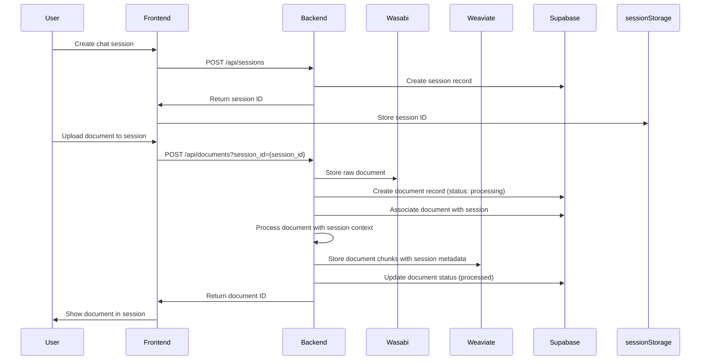
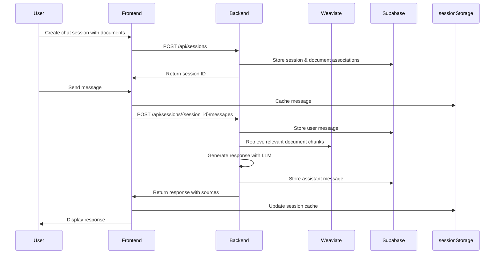

# AnyDocAI Frontend API Implementation Plan

## Overview

This document outlines the technical workflow, user workflow, data storage strategy, and API implementation details for AnyDocAI's frontend.

## User Workflow

1. **Authentication**
   - User registers or logs in
   - Authentication token is stored in localStorage

2. **Session-First Document Management**
   - User creates a new chat session
   - User uploads documents directly to the session
   - Documents are processed and indexed in the backend with session context
   - User can view documents associated with the current session

3. **Chat Session Flow**
   - User interacts with documents in the current session
   - User sends messages and receives AI responses
   - User can switch between different chat sessions
   - Each session maintains its own document context

4. **Chat Modes**
   - User can toggle between RAG mode (simple document Q&A)
   - User can toggle Agent mode (for complex tasks like chart generation)

## Technical Workflow

### 1. Session-First Document Processing Flow



### 2. Chat Session Flow



## Data Storage Strategy

### 1. Server-side Storage

| Data Type | Storage System | Purpose |
|-----------|----------------|---------|
| User accounts | Supabase | Authentication and user management |
| Raw documents | Wasabi S3 | Original document storage |
| Document metadata | Supabase | Status, file info, ownership |
| Document chunks | Weaviate | Vector embeddings for semantic search |
| Chat sessions | Supabase | Session metadata and document associations |
| Chat messages | Supabase | Message history with metadata |

### 2. Client-side Storage

| Data Type | Storage System | Purpose |
|-----------|----------------|---------|
| Auth token | localStorage | Persistent authentication |
| Current session | sessionStorage | Active session data |
| Recent messages | sessionStorage | Current conversation context |
| Document metadata | sessionStorage | Document info for current session |
| UI preferences | localStorage | User interface settings |

## API Implementation Details

### Authentication APIs

```javascript
// api/auth.js
export const authApi = {
  register: (email, password) =>
    axios.post('/api/auth/register', { email, password }),

  login: (email, password) =>
    axios.post('/api/auth/login', { email, password }),

  logout: () =>
    axios.post('/api/auth/logout')
};
```

### Document APIs

```javascript
// api/documents.js
export const documentApi = {
  uploadDocumentToSession: (file, sessionId) => {
    const formData = new FormData();
    formData.append('file', file);
    formData.append('session_id', sessionId);
    return axios.post('/api/documents/upload', formData, {
      headers: { 'Content-Type': 'multipart/form-data' }
    });
  },

  listSessionDocuments: (sessionId) =>
    axios.get(`/api/sessions/${sessionId}/documents`),

  listAllDocuments: (page = 1, limit = 10) =>
    axios.get(`/api/documents?page=${page}&limit=${limit}`),

  getDocumentById: (documentId) =>
    axios.get(`/api/documents/${documentId}`),

  deleteDocument: (documentId, sessionId = null) =>
    sessionId
      ? axios.delete(`/api/sessions/${sessionId}/documents/${documentId}`)
      : axios.delete(`/api/documents/${documentId}`)
};
```

### Session APIs

```javascript
// api/sessions.js
export const sessionApi = {
  // Create a new session (session-first approach)
  createSession: (name) =>
    axios.post('/api/sessions', { name }),

  listSessions: () =>
    axios.get('/api/sessions'),

  getSession: (sessionId) =>
    axios.get(`/api/sessions/${sessionId}`),

  updateSession: (sessionId, name) =>
    axios.put(`/api/sessions/${sessionId}`, { name }),

  deleteSession: (sessionId) =>
    axios.delete(`/api/sessions/${sessionId}`),

  // These methods are still available but less commonly used in session-first approach
  addDocumentsToSession: (sessionId, documentIds) =>
    axios.post(`/api/sessions/${sessionId}/documents`, { document_ids: documentIds }),

  removeDocumentFromSession: (sessionId, documentId) =>
    axios.delete(`/api/sessions/${sessionId}/documents/${documentId}`)
};
```

### Chat APIs

```javascript
// api/chat.js
export const chatApi = {
  getMessages: (sessionId) =>
    axios.get(`/api/sessions/${sessionId}/messages`),

  sendMessage: (sessionId, message, useAgent = false) =>
    axios.post(`/api/sessions/${sessionId}/messages`, {
      message,
      use_agent: useAgent
    }),

  getSuggestions: (sessionId) =>
    axios.get(`/api/sessions/${sessionId}/suggestions`)
};
```

## Session Storage Implementation

```javascript
// utils/sessionStorage.js
export const sessionStorageUtil = {
  // Current session data
  setCurrentSession: (sessionData) => {
    sessionStorage.setItem('currentSession', JSON.stringify(sessionData));
  },

  getCurrentSession: () => {
    const data = sessionStorage.getItem('currentSession');
    return data ? JSON.parse(data) : null;
  },

  // Messages cache
  cacheMessages: (sessionId, messages) => {
    sessionStorage.setItem(`messages_${sessionId}`, JSON.stringify(messages));
  },

  getCachedMessages: (sessionId) => {
    const data = sessionStorage.getItem(`messages_${sessionId}`);
    return data ? JSON.parse(data) : [];
  },

  // Document metadata cache
  cacheDocumentMetadata: (documentId, metadata) => {
    const cache = JSON.parse(sessionStorage.getItem('documentCache') || '{}');
    cache[documentId] = metadata;
    sessionStorage.setItem('documentCache', JSON.stringify(cache));
  },

  getCachedDocumentMetadata: (documentId) => {
    const cache = JSON.parse(sessionStorage.getItem('documentCache') || '{}');
    return cache[documentId] || null;
  }
};
```

## API Call Sequence Examples

### Example 1: Creating a new chat session, uploading documents, and sending a message

```javascript
// 1. Create a new session
const sessionResponse = await sessionApi.createSession("Research on Climate Change");

// 2. Store session in sessionStorage
const sessionId = sessionResponse.data.session_id;
sessionStorageUtil.setCurrentSession(sessionResponse.data);

// 3. Upload documents to the session
const fileInput = document.getElementById('fileInput');
const files = fileInput.files;
const uploadPromises = [];

for (let i = 0; i < files.length; i++) {
  uploadPromises.push(documentApi.uploadDocumentToSession(files[i], sessionId));
}

// Wait for all uploads to complete
const uploadResults = await Promise.all(uploadPromises);

// 4. Get documents associated with the session
const documentsResponse = await documentApi.listSessionDocuments(sessionId);
const documents = documentsResponse.data.documents;

// 5. Cache document metadata
documents.forEach(doc => {
  sessionStorageUtil.cacheDocumentMetadata(doc.file_id, doc);
});

// 6. Send a message
const messageResponse = await chatApi.sendMessage(
  sessionId,
  "Summarize the key findings from these documents."
);

// 7. Cache the messages
const messages = [
  { role: "user", content: "Summarize the key findings from these documents." },
  { role: "assistant", content: messageResponse.data.response }
];
sessionStorageUtil.cacheMessages(sessionId, messages);

// 8. Display the response to the user
displayMessage(messageResponse.data);
```

### Example 2: Continuing an existing chat session

```javascript
// 1. Get current session from sessionStorage
const currentSession = sessionStorageUtil.getCurrentSession();

// 2. Get cached messages or fetch from API if not cached
let messages = sessionStorageUtil.getCachedMessages(currentSession.session_id);
if (!messages.length) {
  const messagesResponse = await chatApi.getMessages(currentSession.session_id);
  messages = messagesResponse.data.messages;
  sessionStorageUtil.cacheMessages(currentSession.session_id, messages);
}

// 3. Display existing messages
displayMessages(messages);

// 4. Send a new message
const newMessage = "What are the economic impacts mentioned in the documents?";
const messageResponse = await chatApi.sendMessage(
  currentSession.session_id,
  newMessage
);

// 5. Update cached messages
messages.push(
  { role: "user", content: newMessage },
  { role: "assistant", content: messageResponse.data.response }
);
sessionStorageUtil.cacheMessages(currentSession.session_id, messages);

// 6. Display the new response
displayMessage(messageResponse.data);
```

## API Parameters Reference

| API Endpoint | Method | Parameters | Response |
|--------------|--------|------------|----------|
| `/api/auth/register` | POST | `email`, `password` | User data with token |
| `/api/auth/login` | POST | `email`, `password` | User data with token |
| `/api/documents/upload` | POST | `file` (FormData), `session_id` | Document metadata |
| `/api/documents` | GET | `page`, `limit` | List of documents |
| `/api/sessions` | POST | `name` (document_ids is optional) | Session data |
| `/api/sessions` | GET | None | List of sessions |
| `/api/sessions/{id}` | GET | None | Session details |
| `/api/sessions/{id}/documents` | GET | None | List of session documents |
| `/api/sessions/{id}/messages` | GET | None | List of messages |
| `/api/sessions/{id}/messages` | POST | `message`, `use_agent` | AI response |
| `/api/sessions/{id}/suggestions` | GET | None | Suggested queries |
